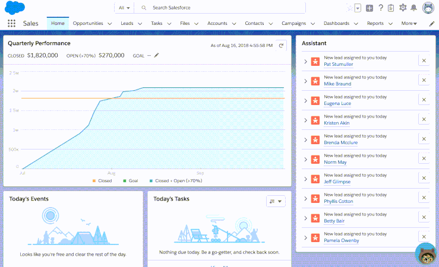

# Lightning Assistant
A draggable, floating, Lightning container for embedding into Lightning pages and applications.



## Developer Guide

### Setup your Development Environment

#### Install Salesforce CLI for use with SFDX

1. `npm install -g sfdx-cli`
2. [Salesforce CLI Docs](https://developer.salesforce.com/docs/atlas.en-us.sfdx_cli_reference.meta/sfdx_cli_reference/cli_reference.htm)

#### Cloning the code base and installing dependencies

1. Clone repository to a local directory.

### Setting Up and Deploying project to a Scratch Org

1. Authenticate to your Dev Hub Org.

    `sfdx force:auth:web:login --setdefaultdevhubusername --setalias DevHub`

1. Create a Scratch Org
    ```
    sfdx force:org:create --definitionfile config/workspace-scratch-def.json --setalias assistant --setdefaultusername
    sfdx force:source:push
    sfdx force:org:open --path /one/one.app
    ```
